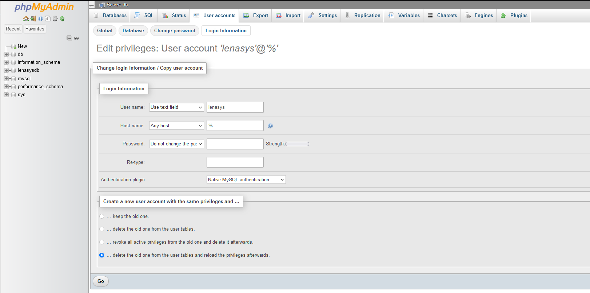

# LenaSYS-docker
Docker environment for hosting [LenaSYS](https://github.com/HGustavs/LenaSYS). This project automatically clones the latest version of LenaSYS and hosts it with the proper settings. 

## prerequisites

In order to use this project you need to install:
 - [Git](https://github.com/git-guides/install-git)
 - [Docker](https://docs.docker.com/get-docker/)

## Installation

1. First clone the project to a location of your liking:

    ``` git clone https://github.com/a22willi/LenaSYS-dockerenv.git ```

2. Start the docker containers 

    Navigate to the *LenaSYS-dockerenv* folder, and run the command:

    ``` docker compose up -d ```

3. Run the install script

    Navigate to [LenaSYS/install/install.php](http://localhost/LenaSYS/install/install.php) and run the installer. The first page should have its information preselected. When asked for a database root password, simply write `password`.

4. Running Linux?

    Since the LenaSYS repository needs to remain under the ownership of the `www-data` user, you may lack permission to modify the files. To gain access, run the command `chmod 777 -R LenaSYS`. This will allow any user to modify the files. However, Git will see modified file permissions as changes. To prevent this, run `git config core.fileMode false`.

## Current limitations

Due to current limitations with the installer, the MySQL-user is limited to connect from the same hostname as previoulsy specified. This does not work for docker installations such as this one. See [issue-#14281](https://github.com/HGustavs/LenaSYS/issues/14281).

To circumvent this:

- open [phpmyadmin](http://localhost:8080). 
- Navigate to `User accounts` tab and click the `lenasys` user.
- Click `Login Information` and change the hostname to `%`.
- Select `... delete the old one from the user tables and reload the privileges afterwards.`
- Click `Go`.

It should look like this:
